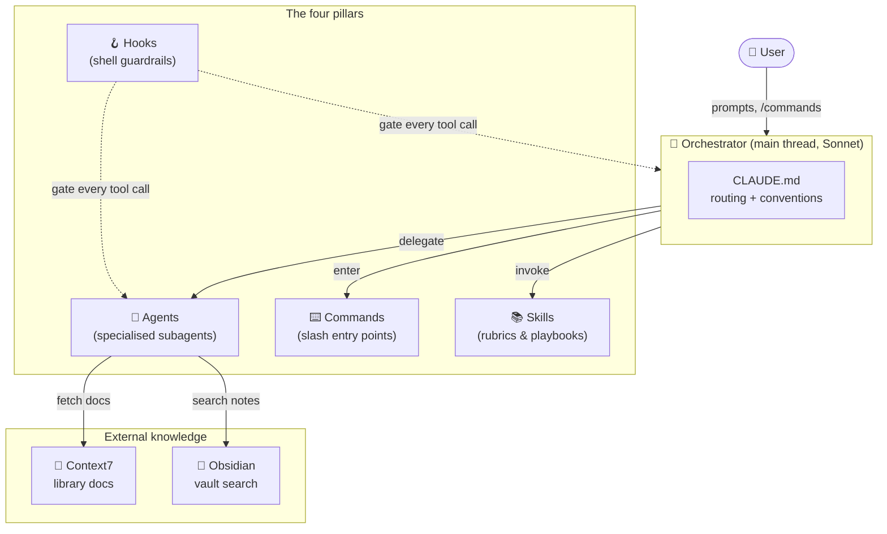
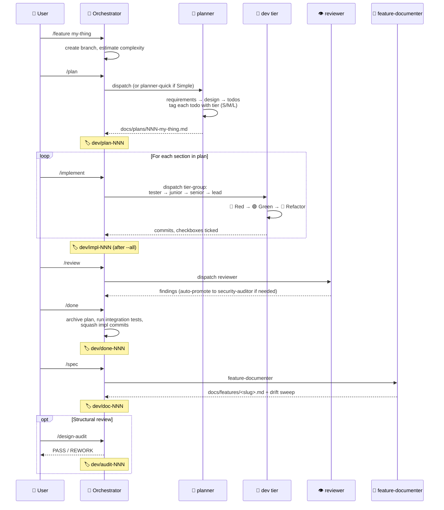
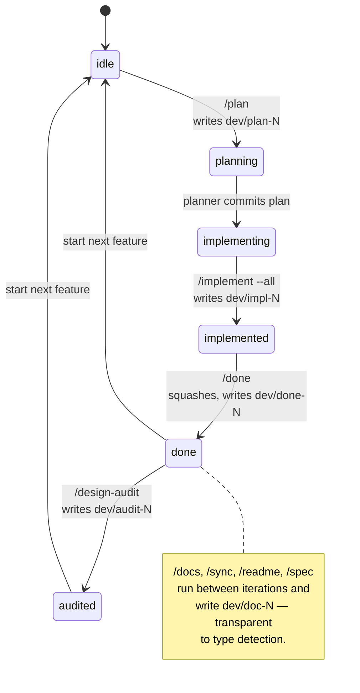

# `~/.claude` — my personal Claude Code setup

> This is the `~/.claude/` config I use day-to-day on pet projects. Opinionated toward **TDD discipline** and tied into an **Obsidian vault** for notes and references. Putting it up as a personal showcase — anyone's welcome to try it, but it's not packaged as a product.
>
> ⚠️ *Honest framing:*
> - **My setup, my taste.** It fits how *I* work on *my* pet projects. Take what's useful; ignore what isn't.
> - **Obsidian is assumed.** I keep design notes, research, and book highlights in an Obsidian vault — the orchestrator reads them via MCP using `brain/<path>` references. Without a vault that piece falls back to nothing; everything else still works.
> - **TDD discipline is prompt-level except at commit time.** Only `pre-commit-green.sh` is mechanically enforced. See [Caveats](#caveats) for cost, security, and version notes.

---

## Table of Contents

- [Overview](#overview)
- [What you get](#what-you-get)
- [Quick start](#quick-start)
- [Architecture in one picture](#architecture-in-one-picture)
- [The development loop](#the-development-loop)
- [Workflow tags & state machine](#workflow-tags--state-machine)
- [Agents](#agents) · [Commands](#commands) · [Skills](#skills) · [Hooks](#hooks)
- [MCP servers](#mcp-servers)
- [Quality tooling](#quality-tooling)
- [Operational conventions](#operational-conventions)
- [Layout reference](#layout-reference)
- [Extending it](#extending-it)
- [Caveats](#caveats)

---

## Overview

Claude Code out of the box is powerful but unopinionated — it'll skip a test if you're not watching, batch unrelated changes into a giant commit, or ramble through a feature with no plan. Fine for tinkering, painful on real software.

The setup I run instead is a **disciplined development loop**:

- 📋 **Plan first.** `/plan` dispatches a planner agent that breaks the work into todos tagged by effort (S / M / L) and recommended dev tier.
- 🔴🟢🔵 **TDD per todo.** `/implement` walks each todo through Red → Green → Refactor under a specialised dev agent — `junior-dev`, `senior-dev`, or `lead-dev` depending on complexity.
- ✅ **Gates before close.** `/review`, `/design-audit`, `/security-audit`, `/mutate` are explicit quality passes — never implicit.
- 📒 **Docs stay current.** `/spec`, `/sync`, `/readme` re-anchor live specs and READMEs against the code via a drift sweep after every meaningful change.
- 🏷️ **Git-tag state machine.** Each iteration is anchored by `dev/plan-NNN` → `dev/impl-NNN` → `dev/done-NNN` tags. `/done` squashes everything between `dev/plan` and `dev/impl` into a single `feat:` or `refactor:` commit.

The **orchestrator** (the main Claude Code thread) routes each request to whichever specialist agent fits — 14 of them, tuned across Haiku, Sonnet, and Opus tiers so cost matches task. The orchestrator itself rarely implements anything; its job is *routing* and *synthesis*.

**The result.** One clean squash commit per shipped feature, a complete paper trail of plan + tests + commits + audits, and a model that rarely breaks discipline silently. When it does, a hook usually catches it before the commit lands.

---

## What you get

| 🎁 | Pillar | Count | Purpose |
|---|--------|-------|---------|
| 🤖 | **Agents** | 14 | Specialised subagents — planning, dev tiers, review, security, docs |
| ⌨️ | **Commands** | 17 | Slash commands that drive the TDD lifecycle (`/feature` → `/plan` → `/implement` → `/done` → `/spec`) |
| 📚 | **Skills** | 7 | Reusable rubrics & playbooks (design, TDD, mutation testing, feature docs, todo tracking) |
| 🪝 | **Hooks** | 6 | Shell scripts wired into `UserPromptSubmit` / `PreToolUse` / `Stop` events |
| 🔌 | **MCPs** | 2 | Context7 (library docs) + Obsidian (vault read/search) |
| 🧩 | **Plugins** | 3 | Claude-Code-side extensions enabled in `settings.json` |
| 🏷️ | **Tag families** | 5 | Git tags (`dev/plan-NNN`, `dev/impl-NNN`, `dev/done-NNN`, `dev/audit-NNN`, `dev/doc-NNN`) act as the workflow state machine |

Nothing here is required — pick the pieces that fit your workflow.

---

## Quick start

If you want to try it on one of your own projects:

```bash
# 1. Backup an existing config if you have one
mv ~/.claude ~/.claude.backup 2>/dev/null

# 2. Clone this repo into ~/.claude
git clone <this-repo-url> ~/.claude

# 3. (Usually unnecessary — git preserves the bit, but in case it didn't)
chmod +x ~/.claude/hooks/*.sh

# 4. (Per project — opt into the strict TDD gates)
cd /path/to/your/project
mkdir -p .claude
echo "npm test --silent"             > .claude/test-cmd               # gates `git commit`
echo "npm run lint"                  > .claude/lint-cmd               # runs lint before commit
echo "vitest run tests/integration/" > .claude/integration-test-cmd   # gates `/done`
```

Restart Claude Code — slash commands, agents, skills, and hooks load automatically from `~/.claude`.

**Without the sentinel files in step 4**, the strict hooks (`no-git-add-all.sh`, `pre-commit-green.sh`) stay dormant. You still get the agents, commands, and skills — just no mechanical commit gates. Third-party repos and quick prototypes are unblocked by default.

**MCP servers are external.** This repo doesn't install Context7 or Obsidian MCP — configure them in your MCP client per their own docs. The harness only describes how to *use* them once they're available.

**🚀 First time?** Try a single round-trip on a throwaway project: `/feature foo` → `/plan` → `/implement` → `/done`. The rest of this README is reference — read it as you need it.

---

## System architecture



**Reading order:** the orchestrator (main thread) is a router, not an implementer. It receives prompts, picks the right specialist (agent), invokes a rubric (skill), or enters a known workflow (command). Hooks act as cross-cutting guardrails on every tool call regardless of who's making it.

---

## The development loop

A single feature flows through this sequence. Each step writes a git tag — the tag is the *only* source of truth for "where are we in the cycle?".



**Key invariant:** the orchestrator never implements directly when an agent fits. Cost matches task: Haiku for pattern work, Sonnet for judgment, Opus for design and hard reasoning.

---

## Workflow tags & state machine

Five tag families track iteration state. Counters are per-family, zero-padded, monotonic, **never reused**.

| Family | Written by | Anchors | Read by |
|--------|-----------|---------|---------|
| `dev/plan-NNN` | `/plan` (after planner commits the plan file) | The plan commit | `/done` (squash base) |
| `dev/impl-NNN` | `/implement --all` (on completion) | HEAD after last todo commit | `/done` (must exist) |
| `dev/done-NNN` | `/done` (after squash) | The squashed commit | `/design-audit` (must be ancestor of HEAD) |
| `dev/audit-NNN` | `/design-audit` (after chore commit) | The `chore(design-audit)` commit | `/done` (preserved through future squashes) |
| `dev/doc-NNN` | `/docs`, `/sync`, `/readme`, `/spec` | Each respective doc commit | `/done` (transparent — type detection skips past) |

**You never write these by hand** — commands manage them. Treat the tag system as the audit trail, not user homework.



**Hard rules enforced by the harness:**
- `/design-audit` refuses to run unless the latest `dev/done-NNN` is reachable from `HEAD` (no mid-iteration audits — but doc/audit commits on top are fine).
- `/done` refuses to run with unchecked plan items, dirty tree, or red integration tests.
- `Stop` hook warns when a session ends mid-iteration (`dev/plan-N` set without `dev/impl-N`, etc.).

---

## Agents

The orchestrator delegates by default. Each agent has a single sharp purpose and a model tuned for it.

| 🎭 | Agent | Purpose | Model |
|---|-------|---------|-------|
| 📐 | **planner** | Requirements breakdown + technical design; tags each todo with effort (S/M/L) and recommended dev tier | opus |
| 📋 | **planner-quick** | Lightweight planner for Simple tasks — fast plan, no design sections; escalates to `planner` if Medium/Complex | sonnet |
| 🥷 | **lead-dev** | TDD for hard problems — unknown root cause, concurrency, perf, cross-module invariants, security reasoning | opus |
| 🧙 | **senior-dev** | TDD when significant judgment is needed: API shape, multiple interacting parts, implicit requirements to surface | sonnet |
| 👶 | **junior-dev** | **Default** for S and most M todos — trivial work, mechanical refactors, contained judgment calls | haiku |
| 🎬 | **ui-integration-tester** | UI component-seam tests — writes red integration tests at component boundaries; never fixes bugs | sonnet |
| 🔬 | **debugger** | Targeted debugging — reproduce, bisect, instrument. Produces a *diagnosis*, not a fix | opus |
| 👁️ | **reviewer** | Code quality analysis; spawns persona reviews (correctness / performance / maintainability). Auto-emits UI-coverage verdict when diff touches UI files | sonnet |
| 😤 | **design-critic** | **Zero-tolerance** structural pass — SOLID, Clean Code, Fowler smells, hard size/nesting thresholds. PASS / REWORK verdict | opus |
| 🛡️ | **security-auditor** | OWASP security scan; `/review` auto-promotes here when diff touches auth / crypto / injection surfaces | opus |
| 📝 | **docs-writer** | Doc-vs-code drift audit + targeted updates for `README.md`, `CLAUDE.md`, feature docs | sonnet |
| 📒 | **feature-documenter** | Live-spec writer — runs after `/done`. Reads the squashed commit + archived plan, emits a < 100-line feature doc, and patches stale docs | opus |
| 🏗️ | **bootstrapper** | Project scaffolding (greenfield) **or** retrofit (`--retrofit` adds quality tooling to existing repos) | haiku |
| 🗺️ | **project-expert** | Read-only codebase Q&A — never modifies files | sonnet |

**Tier selection.** The planner recommends a tier per todo. Override manually when needed. Escalate `senior-dev` → `lead-dev` if the problem reveals hidden depth (root cause unclear, tests won't stabilize).

---

## Commands

Slash commands are workflow entry points. They orchestrate agents, write tags, and enforce preconditions.

| Phase | Commands | What they do |
|-------|----------|--------------|
| 🚀 **Start** | `/bootstrap` (`--retrofit`), `/feature <name>` | Scaffold a new project or start a new feature branch |
| 📋 **Plan** | `/plan <name>` (`--deep`), `/expert` | Run planner; ask read-only questions about the codebase |
| 🔵 **TDD** | `/implement`, `/refactor`, `/commit`, `/diagnose <symptom>` | Drive Red/Green/Refactor and targeted debugging |
| ✅ **Finish** | `/review`, `/design-audit`, `/security-audit`, `/mutate`, `/done`, `/spec` | Quality gates → close iteration → live-spec |
| 🔧 **Docs** | `/docs`, `/sync`, `/readme` | Per-trigger documentation refresh |

**Selected behaviors worth knowing:**

- **`/plan`** writes `dev/plan-NNN` *after* the planner commits the plan file — the tag anchors the plan commit so `/done` can reset back to it during the squash.
- **`/implement`** dispatches one tier-group at a time within a section. Order: any `*-tester` group(s) → `junior-dev` → `senior-dev` → `lead-dev`. Multiple `*-tester` groups dispatch in plan-listed order.
- **`/done`** is strict: archives the plan, runs integration tests (if `.claude/integration-test-cmd` exists and is non-empty), squashes all impl commits, writes `dev/done-NNN`. Refuses to run with unchecked todos, dirty tree, or red integration tests.
- **`/design-audit`** refuses unless the latest `dev/done-NNN` is an ancestor of `HEAD`. Mid-iteration audits are a footgun.
- **`/spec`** runs `feature-documenter` after `/done` to write `docs/features/<slug>.md` and sweep all top-level docs for drift caused by the new feature.
- **`/review`** dispatches the `reviewer` agent. The orchestrator's routing rules in `CLAUDE.md` auto-escalate to `security-auditor` when the diff touches auth, crypto, or injection surfaces, and the reviewer emits a UI-coverage verdict (`GOOD` / `WEAK` / `MISSING`) when the diff touches UI files. (Both behaviors live in the routing layer, not in the `/review` command itself.)
- **`/review` vs `/design-audit` — when to use which:** `/review` is a balanced quality pass (correctness, performance, maintainability) intended after every meaningful iteration. `/design-audit` is a stricter structural pass (SOLID, smells, hard size/nesting thresholds), persists a report under `docs/design-audits/`, and emits PASS/REWORK — heavier, run periodically rather than every iteration.
- **`/done`** itself bypasses `pre-commit-green.sh` for its two meta-commits (the `chore(archive)` move and the squash). Both are redundant: the archive commit changes no source code, and the squash commit's tree is identical to the last `/implement` commit (which already ran the gate). Justifications are inline in `commands/done.md`. Impl commits during `/implement` are still gated normally.

---

## Skills

Skills are forcing-function rubrics — checklists the orchestrator or an agent loads to make a specific decision well. Not workflows; thinking aids.

| Skill | When it triggers |
|-------|------------------|
| **design-rubric** | Reasoning about code *shape* — "is this a god class?", "should I split this?", "what's the smell?" Covers SOLID, Clean Code, Fowler's smells, DRY/KISS/YAGNI trade-offs |
| **design-patterns** | Designing a new component and wondering whether a pattern (Strategy, Repository, Observer, …) fits — *or* should be avoided |
| **tdd-rubric** | Three high-value TDD decisions: stub vs mock, async test structure, when to change an existing test |
| **ui-test-rubric** | Writing a UI integration test at a component seam — five-section discipline for scope, mocks, query strategy |
| **feature-doc-rubric** | Writing or auditing a `/spec` live-doc — five-section discipline (length budget, drift sweep, behavior verification) |
| **mutation-testing** | Measuring real test quality with Stryker (TS/JS) or mutmut (Python) — when to run, how to read output, common survivor patterns |
| **todo-tracking** | When `docs/plans/` has an active plan — the plan's checkboxes ARE the todo list (not Claude Code's internal `TaskCreate`) |

Skills are auto-discovered by Claude Code from `~/.claude/skills/<name>/SKILL.md`. They're invokable as `/<skill-name>` or fired automatically when their trigger description matches.

---

## Hooks

Hooks are shell scripts wired into Claude Code lifecycle events via `settings.json`. They run on every relevant event, regardless of which agent is acting.

| Event | Script | Purpose |
|-------|--------|---------|
| `UserPromptSubmit` | `intent-classifier.sh` | Regex-matches intent verbs (add / fix / refactor / review / debug / explain / scaffold / document) and injects a routing hint |
| `UserPromptSubmit` | `plan-progress.sh` | Renders a progress bar (`📋 ████░░░░ 4/10 40%`) for any active plan, walking up from cwd |
| `PreToolUse: TaskCreate\|TaskUpdate` | `plan-as-todo.sh` | Denies `TaskCreate`/`TaskUpdate` when an active plan exists in `docs/plans/` — the plan is the todo list |
| `PreToolUse: Bash` | `no-git-add-all.sh` | Denies `git add -A`, `git add --all`, `git add .` (TDD-mode repos only) |
| `PreToolUse: Bash` | `pre-commit-green.sh` | Before `git commit`, runs lint then tests; denies the commit on any failure |
| `Stop` | `stop-guard.sh` | Warns on uncommitted changes, mid-flight iteration state, or doc commits without a `dev/doc-N` tag |

**Two opt-in sentinel files** activate the strict hooks per project:

| Sentinel file | Activates | Purpose |
|---------------|-----------|---------|
| `.claude/test-cmd` | `pre-commit-green.sh`, `no-git-add-all.sh` | Single line — the project's test command (e.g. `npm test --silent`, `pytest -q`) |
| `.claude/lint-cmd` | `pre-commit-green.sh` (lint stage) | Single line — the project's lint command (e.g. `npm run lint`, `ruff check .`) |
| `.claude/integration-test-cmd` | `/done` integration gate only | Single line — UI integration tests (e.g. `vitest run tests/integration/`). Never read by hooks |

**Sentinel discovery.** `pre-commit-green.sh` and `no-git-add-all.sh` walk up from cwd looking for `.claude/test-cmd` / `.claude/lint-cmd`, **stopping at `$HOME`** — so the user's global `~/.claude/` cannot accidentally activate them in unrelated directories. `integration-test-cmd` is read by `/done` only (never by a hook) and resolves the repo root via `git rev-parse --show-toplevel`. `plan-as-todo.sh` walks up looking for `docs/plans/` and stops at `/`.

> ⚠️ The `test-cmd` sentinel activates *both* `no-git-add-all.sh` and the test stage of `pre-commit-green.sh`. A project with only `lint-cmd` set gets the lint gate but not the bulk-add gate — silently asymmetric. Set `test-cmd` (even to a no-op like `:`) if you want the full TDD posture.

---

## MCP servers

Two MCP servers are intentionally configured. Add or remove via `settings.json` and your MCP client config.

### Context7 — library documentation

Used whenever the assistant generates code that uses an external library, looks up an API, or needs setup steps for a framework. Preferred over web search for library docs because the model's training data may be stale.

**Triggers:** the keyword `use context7` in a prompt; references to specific library IDs (`/supabase/supabase`, `/vercel/next.js`); version-specific questions ("Next.js 14 middleware").

**Tools:** `resolve-library-id` → `query-docs` (always in that order).

### Obsidian — vault read & search

Notes referenced as `brain/<path>` are paths inside your Obsidian vault. The orchestrator never asks for clarification — `brain/` is the signal.

| Operation | Tool |
|-----------|------|
| Read a note | `mcp__obsidian-mcp-tools__get_vault_file` (strip `brain/` prefix) |
| Search | `mcp__obsidian-mcp-tools__search_vault_simple` / `search_vault_smart` |
| Write / update / create | Filesystem (`Read` → `Edit`/`Write`) — faster than MCP |

To resolve the vault root for filesystem writes: call `mcp__obsidian-mcp-tools__get_server_info` once and cache for the session.

### Claude-Code plugins (different from MCPs)

`settings.json` also enables three Claude-Code-side plugins via the `enabledPlugins` block. Plugins are discovered through the marketplace, not through your MCP client — they extend Claude Code itself rather than exposing external tools.

| Plugin | Purpose |
|--------|---------|
| `context7@claude-plugins-official` | Bridges to the Context7 MCP described above |
| `skill-creator@claude-plugins-official` | Scaffolds, edits, and evaluates skills (used during `~/.claude/skills/` development) |
| `claude-md-management@claude-plugins-official` | Audits and improves project `CLAUDE.md` files |

Disable any you don't want by removing the entry from `enabledPlugins` in `settings.json`.

---

## Quality tooling

Per-project mutation testing and architecture fitness packages are listed in [`QUALITY_TOOLING.md`](./QUALITY_TOOLING.md). The bootstrapper installs them during `/bootstrap`; `/mutate` and `/design-audit architecture` consume them.

| Stack | Mutation testing | Architecture fitness |
|-------|------------------|----------------------|
| TS / JS | `@stryker-mutator/core` + runner (jest / vitest / mocha) | `dependency-cruiser` |
| Python | `mutmut` | `import-linter` |

**Why these:**
- **Stryker / mutmut** measure whether tests catch *bugs*, not just whether lines were executed.
- **dependency-cruiser / import-linter** enforce layered architecture deterministically — catch circular deps and forbidden imports before they become load-bearing.

`/bootstrap --retrofit` adds these to existing projects without overwriting configs or upgrading versions.

---

## Operational conventions

A handful of behaviors are enforced at the orchestrator (prompt) layer rather than mechanically.

### Announcements

Every meaningful action emits a one-line status before it runs — agent dispatch, skill invocation, tool call, or reasoning step. The user always knows what's happening *right now*.

```
🥷 lead-dev → diagnosing flaky integration test
👶 junior-dev → A6: rename UserSvc → UserService | 5/34 14%
📐 planner → breaking down "billing pipeline" feature
📚 design-rubric → checking god-class threshold
🔍 reading src/auth/session.ts to find the leak
```

When the plan-progress hook fires, its output appends to the dispatch line.

### Complexity tiers

Every plan starts with a complexity estimate, which drives planner choice and analysis depth.

| Level | Approach | Planner |
|-------|----------|---------|
| 🟢 **Simple** | Quick plan → TDD | `planner-quick` |
| 🟡 **Medium** | Detailed plan → design | `planner` |
| 🔴 **Complex** | Multi-perspective analysis (4 lenses: minimalist, extensibility, devil's advocate, user advocate) | `planner` (`--deep`) |

### TDD phase boundaries

Phases are conversational within each dev agent — but the boundaries are non-negotiable.

| Phase | ✓ Can do | ✗ Cannot do |
|-------|----------|-------------|
| 🔴 Red | Write ONE failing test | Write implementation |
| 🟢 Green | Minimal code to pass | Add tests, refactor |
| 🔵 Refactor | Restructure with tests green | Change behavior |
| ✅ Commit | Stage named files, conventional message | `git add -A`, batch multiple cycles |

### Scope guard

When tempted to exceed scope: *"I noticed X could be improved, but it's outside our current plan. Add to backlog?"* — never silently add unrequested features.

---

## Layout reference

```text
~/.claude/
├── CLAUDE.md                  ← orchestrator instructions (the prompt)
├── settings.json              ← hook wiring, plugins, status line
├── README.md                  ← this file
├── QUALITY_TOOLING.md         ← mutation testing + architecture fitness reference
│
├── agents/                    ← 14 specialised subagent definitions
├── commands/                  ← 17 slash commands
├── skills/                    ← 7 reusable rubrics (each in its own dir with SKILL.md)
└── hooks/                     ← 6 shell hooks
    ├── intent-classifier.sh
    ├── plan-progress.sh
    ├── plan-as-todo.sh
    ├── no-git-add-all.sh
    ├── pre-commit-green.sh
    └── stop-guard.sh
```

**Per-project (in any repo):**

```text
your-project/
├── .claude/
│   ├── test-cmd               ← opt in to pre-commit-green (test stage) + no-git-add-all
│   ├── lint-cmd               ← opt in to pre-commit-green (lint stage)
│   └── integration-test-cmd   ← /done integration gate
└── docs/
    ├── plans/                 ← active feature plans (one at a time)
    ├── archive/               ← completed plans (moved here by /done)
    ├── features/              ← live specs written by /spec
    └── design-audits/         ← persisted design-critic reports
```

---

## Extending it

Adding to the harness is straightforward — every piece is just a markdown or shell file.

| Add a... | Create | Notes |
|----------|--------|-------|
| **Slash command** | `commands/<name>.md` with frontmatter (`description`, `model`, `allowed-tools`) | Becomes available as `/<name>` after restart |
| **Subagent** | `agents/<name>.md` with frontmatter (`name`, `description`, `tools`, `model`) | Reference from `CLAUDE.md` routing table or call directly via `Task` |
| **Skill** | `skills/<name>/SKILL.md` with frontmatter (`name`, `description`) | Auto-discovered; description must be precise enough for trigger matching |
| **Hook** | `hooks/<name>.sh` (executable) + entry in `settings.json` under `hooks.<EventName>` | Match on `tool_name` for `PreToolUse` / `PostToolUse`; exit non-zero to deny |
| **MCP server** | Configure in your MCP client; add behavioral guidance to `CLAUDE.md` | Servers are external — `settings.json` only enables Claude-side plugins |

When a new pattern appears 3+ times across iterations, the convention is to extract it: into a skill if it's a decision, into an agent if it's a role, into a hook if it's a guardrail, into a command if it's a workflow.

---

## Caveats

A few honest tradeoffs to know before adopting:

- **Cost is real.** Six of the 14 agents run on Opus (`planner`, `lead-dev`, `debugger`, `design-critic`, `feature-documenter`, `security-auditor`). A medium feature can burn meaningful API spend. Override per-agent (edit the `model:` frontmatter in `agents/<name>.md`) when cost matters.
- **TDD is prompt-level except at commit time.** `pre-commit-green.sh` is the only mechanical TDD gate. Nothing prevents an agent from writing implementation before a test — the cycle discipline lives in the prompt and the agent definitions.
- **Hooks shell out, MCPs send data externally.** Audit `hooks/*.sh` and any MCP server you configure before trusting them with sensitive code.
- **Version-coupled.** The hook contract (`hookSpecificOutput.permissionDecision`, `PreToolUse` matcher names like `TaskCreate`) is tied to recent Claude Code versions. If something fails to load, check that your client supports the matchers in `settings.json`.
- **No troubleshooting guide yet.** When a hook denies a legitimate action, the fix is to read the script, then either silence the gate (remove the sentinel file) or address the underlying signal.
- **Customization is direct.** Edit `~/.claude/agents/<name>.md`, `~/.claude/commands/<name>.md`, or `~/.claude/CLAUDE.md` to tune behavior — there's no per-project override layer for global agents/commands.
- **Personal config, not a product.** This grew out of one engineer's daily workflow. The pieces are coherent for that workflow; partial adoption is supported but tight coupling exists between `/plan`, `/implement`, `/done`, and `feature-documenter` via the tag system.

---

## License

MIT. Use, fork, modify, redistribute — no warranty.
